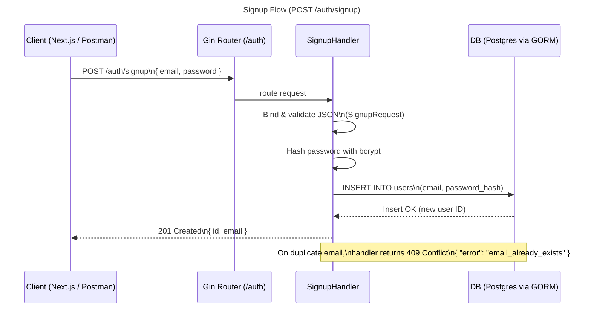
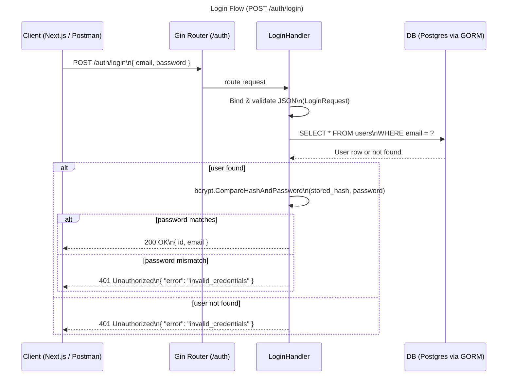

Refer yelp-journey-backend for backend code: https://github.com/prajithravisankar/yelp-journey-backend

```mermaid
sequenceDiagram
    title Signup Flow (POST /auth/signup)

    participant C as Client (Next.js / Postman)
    participant R as Gin Router (/auth)
    participant H as SignupHandler
    participant D as DB (Postgres via GORM)

    C->>R: POST /auth/signup\n{ email, password }
    R->>H: route request
    H->>H: Bind & validate JSON\n(SignupRequest)
    H->>H: Hash password with bcrypt
    H->>D: INSERT INTO users\n(email, password_hash)
    D-->>H: Insert OK (new user ID)
    H-->>C: 201 Created\n{ id, email }

    note over H,D: On duplicate email,\nhandler returns 409 Conflict\n{ "error": "email_already_exists" }
```

---

```mermaid
sequenceDiagram
    title Login Flow (POST /auth/login)

    participant C as Client (Next.js / Postman)
    participant R as Gin Router (/auth)
    participant H as LoginHandler
    participant D as DB (Postgres via GORM)

    C->>R: POST /auth/login\n{ email, password }
    R->>H: route request
    H->>H: Bind & validate JSON\n(LoginRequest)
    H->>D: SELECT * FROM users\nWHERE email = ?
    D-->>H: User row or not found

    alt user found
        H->>H: bcrypt.CompareHashAndPassword\n(stored_hash, password)
        alt password matches
            H-->>C: 200 OK\n{ id, email }
        else password mismatch
            H-->>C: 401 Unauthorized\n{ "error": "invalid_credentials" }
        end
    else user not found
        H-->>C: 401 Unauthorized\n{ "error": "invalid_credentials" }
    end
```

---

