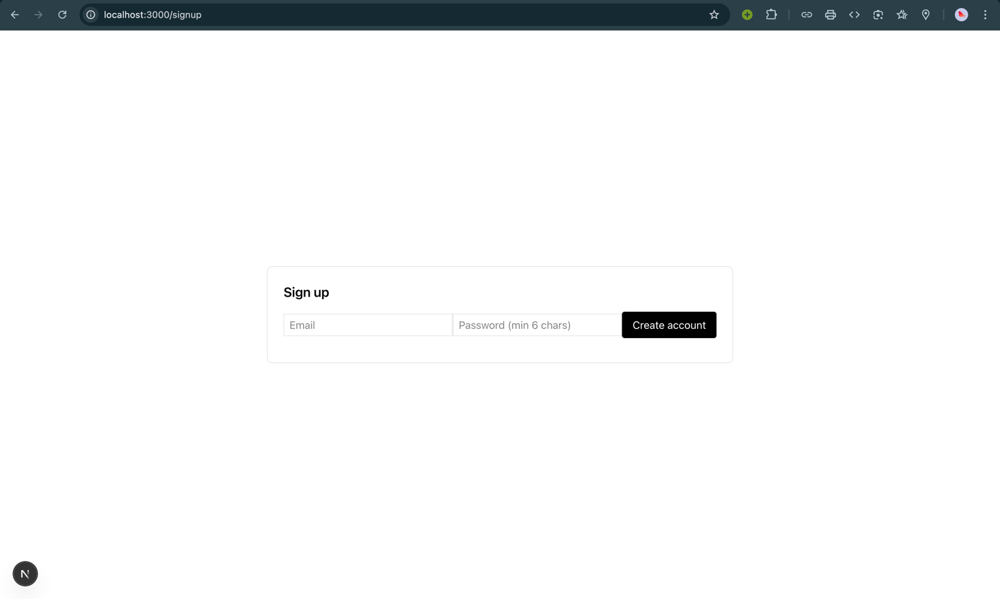
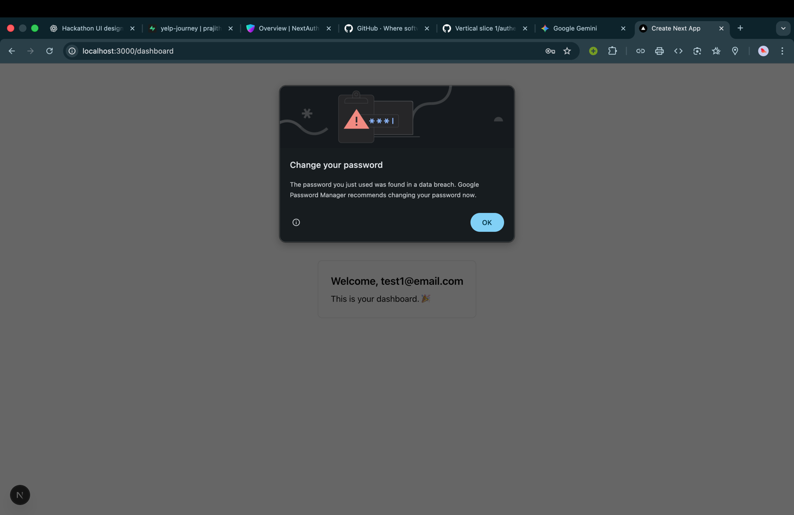
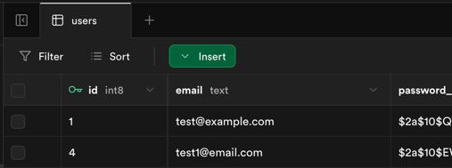

# Yelp Journey – Frontend Notes

## 0. Stack & Setup

- Framework: Next.js 15 (App Router) + React + TypeScript
- Styling: Tailwind CSS + shadcn/ui
- Animation: Framer Motion
- Data fetching: React Query
- Maps: Mapbox GL JS
- Icons: Lucide

### Project Setup Summary

- [x] Created GitHub repo `yelp-journey-frontend`
- [x] Bootstrapped Next.js app with TypeScript & Tailwind
- [x] Installed React Query, Framer Motion, Lucide, Mapbox GL
- [x] Initialized shadcn/ui

> This repo will implement the web UI for the “Yelp Journey” group discovery app:
>
> - screens for creating/joining journeys
> - mood selection
> - route comparison
> - journey following with map & badges

---

## vertical slice 1: Authentication
- `npm install next-auth`
- creating a handles in this file: `app/api/auth/[...nextauth]/route.ts`
  - what is the purpose of [...nextauth]?
    - It is a catch-all route that NextAuth.js uses to handle various authentication-related requests.
    - The square brackets `[]` indicate that it is a dynamic route segment, and the ellipsis `...` means it can match multiple segments.
    - Dynamic routing allows NextAuth.js to handle different authentication actions (like sign-in, sign-out, callback handling, etc.) through a single route file.
    - When a request is made to any of these authentication-related endpoints, Next.js will route the request to this file, where NextAuth.js can process it accordingly.
    - The ellipsis allows for flexibility in handling various authentication actions without needing to create separate route files for each action.
    - For example, requests to `/api/auth/signin`, `/api/auth/signout`, and `/api/auth/callback` will all be handled by this single route file.
    - what is the purpose of route.ts? 
      - route.ts is a file used in Next.js applications to define API routes.
- refer [route.ts](app/api/auth/[...nextauth]/route.ts). 
  - This registers NextAuth API route in your Next.js app.
  - NextAuth handles cookies and session management automatically.
- creating a file `lib/auth.ts` to configure NextAuth options.

- wrapping app with `SessionProvider`
  - A session provider is a component that manages user sessions in a web application.
  - It provides a way to store and access session data, such as user authentication status, user information, and other session-related details.
  - In Next.js, the `SessionProvider` component is typically used in conjunction with authentication libraries like NextAuth.js to handle user sessions.
  - By wrapping your application with `SessionProvider`, you ensure that session data is available throughout your app, allowing you to easily access user information and authentication status in any component.
  - This is especially useful for protecting routes, displaying user-specific content, and managing user authentication state.
  - refer to [providers.tsx](app/providers.tsx) and [layout.tsx](app/layout.tsx)
    - we have abstracted the SessionProvider logic into a separate file `providers.tsx` for better organization and reusability.
    - And then we used the `Providers` component in our main layout file `layout.tsx` to wrap the entire application with the session management functionality.
    - In next js, layout.tsx is a special file that defines the overall layout and structure of your application or a particular directory.
    - It allows you to create a consistent layout that can be shared across multiple pages or components within that directory.
    - By using layout.tsx, you can define common elements such as headers, footers, navigation menus, and other UI components that should be present on every page within that directory.
    - Not only UI but also you can wrap your application with providers like SessionProvider to manage global state or functionality.
    - This ensures that the session management is applied consistently across all pages and components within the application.

- refer [page.tsx](app/signup/page.tsx) and [page.tsx](app/login/page.tsx)
  - with this file we complete the signup/login page implementation.
  - after signing up or logging in we go to the dashboard to show that authentication is successful. [page.tsx](app/dashboard/page.tsx)

- testing authentication flow (signup -> login -> dashboard)
  - 
  - 
  - 